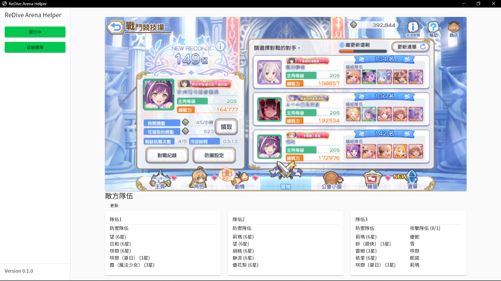

# ReDiveArenaHelper

公主連結 R 競技場角色辨識



## Getting Started

此專案使用 pywin32 操作遊戲, 不適用於 Linux

### Prerequisites

在安裝之前, 請先確定已安裝以下項目

- [Node.js](https://nodejs.org)
- [Python3](https://www.python.org)

### Installation

1. 由於 GUI 使用 React 開發, 請先至 `web` 安裝依賴並建置

   ```bash
   cd web/
   npm install && npm run build
   ```

2. 安裝 Python 依賴

   ```bash
   pip3 install -r requirements.txt
   ```

## Usage

首次執行前請先執行 `update.py` 來下載遊戲數據

執行 `gui.py` 來開啟

```bash
python3 gui.py
```

## Acknowledgments

- [randosoru.me](https://randosoru.me)
  - 台版遊戲數據
- [redive.estertion.win](https://redive.estertion.win)
  - 日版遊戲數據, 角色圖示
- [pcrdfans.com](https://www.pcrdfans.com)
  - 競技場隊伍資料
